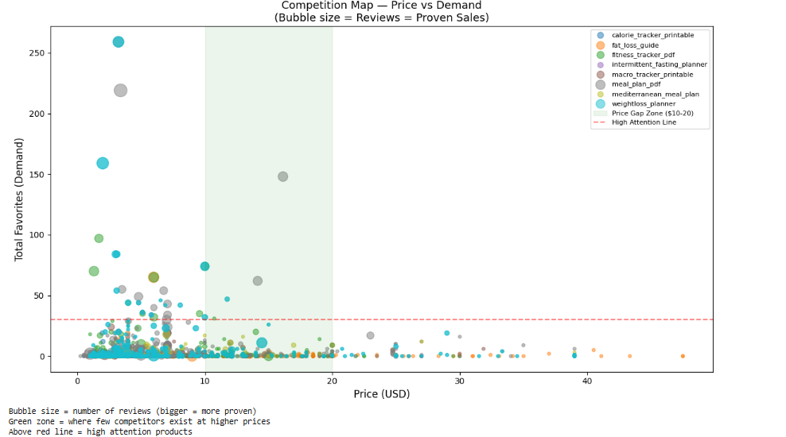

# Etsy Market Analysis — Identifying a Profitable Product Opportunity

> **TL;DR:** Analyzed 3,800+ Etsy listings to uncover a high-opportunity gap in a saturated market and define a data-driven product strategy.

**Project Overview**

This project analyzes ~3,800 Etsy listings to identify a high-opportunity niche and define a data-driven product strategy.

The goal was not just to explore the data, but to **translate insights into a clear business decision**.

---

**Objective**

- Identify a profitable niche within Etsy digital products  
- Understand demand vs competition dynamics  
- Define a strategic product positioning and pricing approach  

---

**Data**

- Source: EverBee Etsy exports  
- Size: ~3,800 listings  
- Key features:
  - Price  
  - Total Favorites (demand signal)  
  - Total Reviews (conversion proxy)  
  - Keywords  
  - Product titles  

> Data was cleaned and processed using Python (Pandas)

---

**Methodology**

The analysis followed a structured approach:

### 1. Market Understanding
- Price vs demand analysis  
- Trend comparison (6m vs 12m)  
- Keyword & audience analysis  

### 2. Opportunity Identification
- Conversion analysis (what sells vs fails)  
- Pricing & competition mapping  
- Opportunity scoring  

---

**Key Insights**

- The market is saturated at **low prices ($2–$7)**  
- Most listings show **low or zero conversions**  
- High-performing products emphasize **structured solutions** (guides, lists, habit systems)  
- Opportunity lies in **better positioning, not lower pricing**  

---

**Market Gap**

Analysis of price vs demand revealed:

- High competition clustered in low-price, low-performance listings  
- Very few competitors positioned in higher-value ranges  
- Some higher-priced listings still achieve strong demand  

This indicates a clear gap for **better-structured, higher-value products**

---

**Strategy**

Based on the analysis:

- **Niche:** Weight loss / lifestyle tracking  
- **Audience:** Beginners seeking structure and simplicity  
- **Positioning:** Structured system (not generic planner)  
- **Pricing Strategy:**
  - Launch: $5.99–$6.99  
  - Scale: $7.99–$9.99  

> Final product concept intentionally not disclosed

---

**Success Metrics**

- Month 1: 4+ favorites (proof of interest)  
- Month 3: 15+ favorites + 2 reviews (market average)  
- Month 6: 36+ favorites + 5 reviews (top 10%)  

---

**Tools Used**

- Python  
- Pandas  
- Matplotlib  

---

**Key Takeaway**

This market is not limited by demand, but by **weak positioning and lack of structured solutions**.

---

**Notes**

This project focuses on **decision-making using data**, not just analysis.

The full product execution is intentionally not included.

**Market Gap Visualization**
 
